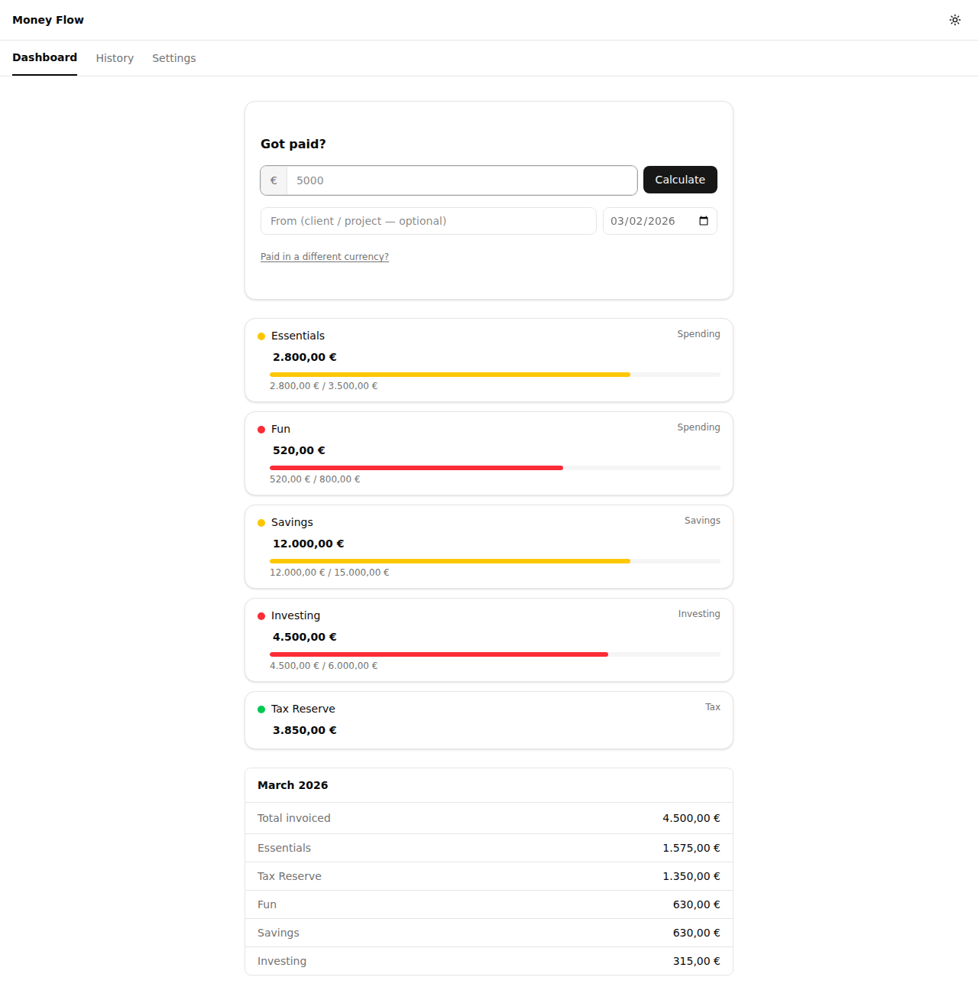
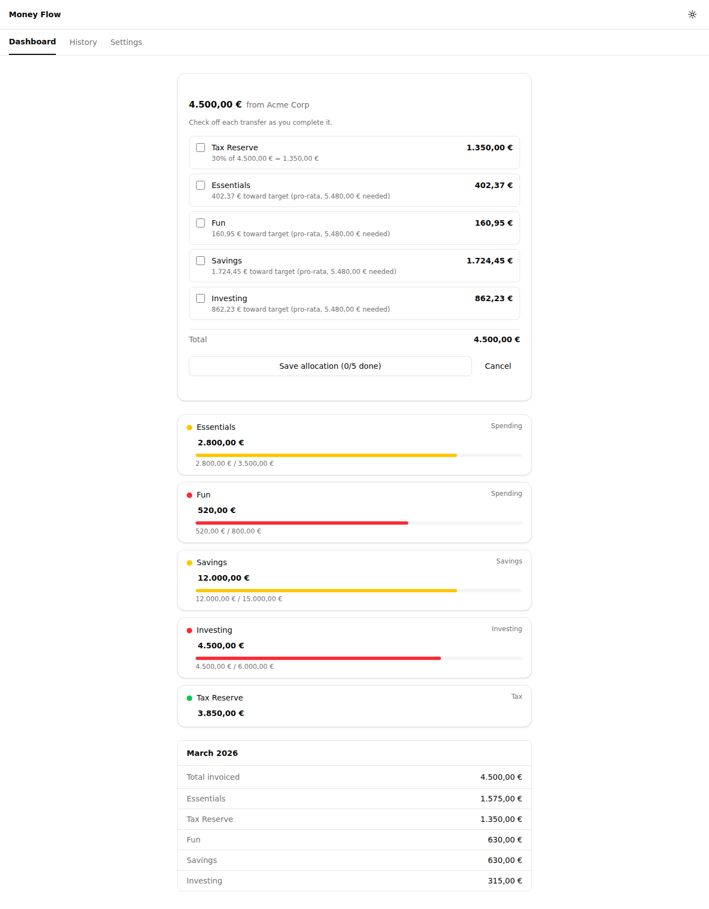
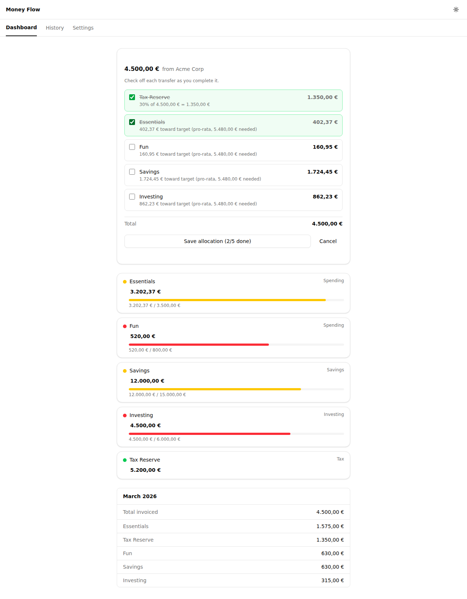
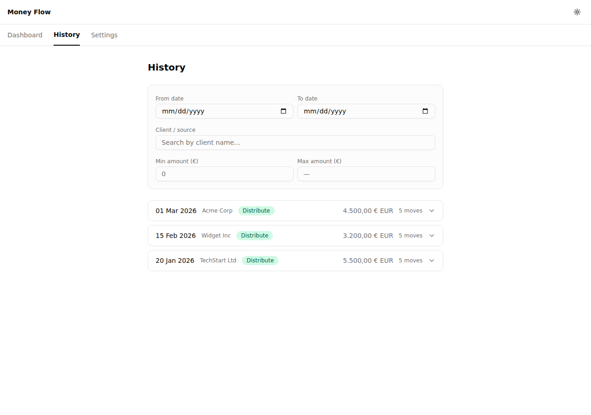
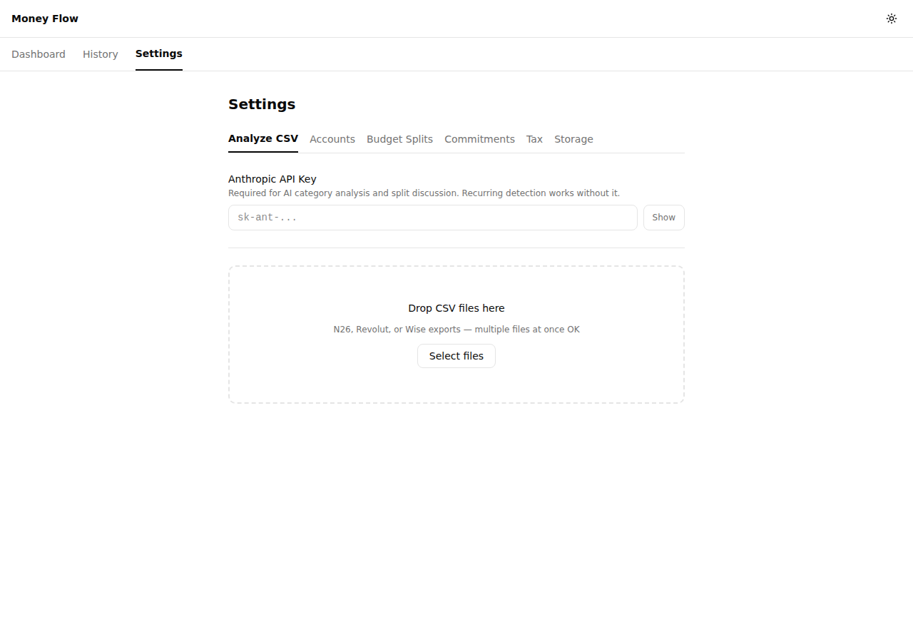

# Money Flow

Freelance budget allocator. When an invoice arrives, it tells you exactly where every euro goes -- so you never have to think about it in the moment.



## What it does

Freelance income is irregular. You get paid in chunks, and each time you need to split the money between tax reserves, living expenses, savings, and investments. Money Flow automates that decision:

1. **Enter the invoice amount** (EUR or foreign currency with manual exchange rate)
2. **Get instant move instructions**: tax reserve, fill account targets, distribute the rest by your configured budget splits
3. **Check off each transfer** as you complete it in your banking app -- balances update in real-time

Every calculation is transparent: you see the formula and reason behind each move.

### Allocation result

Enter an amount, get exact instructions for where each euro goes. Each line shows the destination, amount, and calculation behind it.



### Manual verification

Check off each transfer as you complete it. Balances update immediately. Cancel to undo.



### History

Searchable log of all past allocations, filterable by date, client, and amount range.



### Settings

Six configuration tabs: CSV analysis (AI-powered), accounts, budget splits, recurring commitments, tax rate, and storage.



## Features

- **Smart allocation engine** -- 3-stage pipeline: extract tax, fill account targets (pro-rata if insufficient), distribute surplus by budget splits
- **Account dashboard** -- balances, progress bars toward targets, color-coded status indicators, inline editing
- **CSV import with AI analysis** -- upload N26, Revolut, or Wise exports; AI detects recurring expenses and suggests budget splits (uses Anthropic API, key stays in your browser)
- **Recurring expense detection** -- identifies subscriptions and fixed costs from transaction history, suggests them as floor items
- **Allocation history** -- searchable/filterable log with expandable move details
- **Multi-currency support** -- enter original amount + EUR equivalent for foreign invoices
- **Dark mode** -- system/light/dark toggle, persisted preference
- **Local-first storage** -- File System Access API (Chrome/Edge) stores data as portable JSON files in a folder you choose; IndexedDB fallback for other browsers
- **Integer cents math** -- all money operations use integer arithmetic (no floating-point bugs), with a largest-remainder algorithm that guarantees exact sums
- **Revolut internal transfer detection** -- automatically identifies and excludes inter-account transfers from CSV analysis

## Tech stack

| Layer | Technology |
|-------|-----------|
| Build | Vite 7, TypeScript 5.9 |
| UI | React 19, Tailwind CSS v4, shadcn/ui |
| State | Zustand 5 |
| Storage | File System Access API + IndexedDB fallback |
| CSV parsing | PapaParse |
| AI | Anthropic Messages API (client-side, browser-direct) |
| Testing | Vitest + Testing Library (99 tests) |

## Running locally

```bash
npm install
npm start
# Opens on http://localhost:5173
```

For HTTPS (required for File System Access API), place a `.crt` and `.key` file in the project root -- Vite auto-detects them.

```bash
npm run build    # Production build → dist/
npm test         # Run tests
npm run typecheck
```

## Architecture

The allocation engine (`src/domain/allocationEngine.ts`) is a pure function with zero side effects -- no React, no state mutations, fully testable:

```
Stage 1: Extract tax (configurable %, floor rounding)
Stage 2: Fill accounts toward their targets
         If total gap <= remaining: fill all exactly
         If total gap > remaining: fill pro-rata
Stage 3: Distribute remainder by overflow ratios
         Uses largest-remainder algorithm (exact sum guaranteed)
```

Storage is abstracted behind a `StorageDriver` interface. The app doesn't know or care whether it's writing to the filesystem or IndexedDB -- both persist the same JSON shape.

Zustand stores manage state and manually call `storage.write()` after mutations (no persist middleware).

## Project structure

```
src/
  domain/          Pure business logic (allocation engine)
  features/        Feature modules (dashboard, history, settings)
  lib/             Shared utilities (cents math, CSV parsing, AI client, storage)
  stores/          Zustand state management
  types/           TypeScript type definitions
  components/ui/   shadcn/ui primitives
```

## License

MIT
